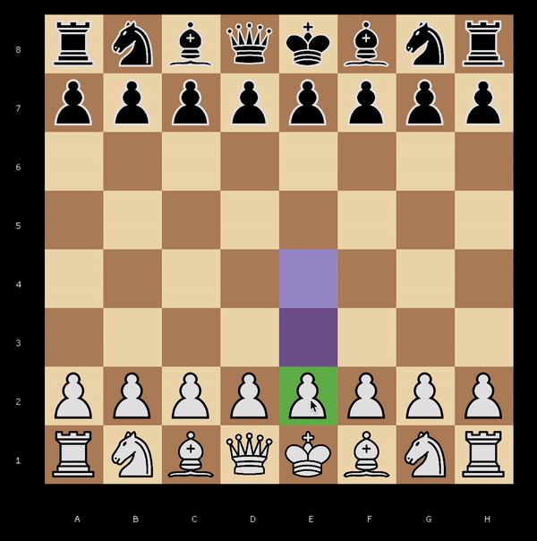

# Chess

## About
This is simple project for learning some things on practice.

## Project structure
- Chess core
- Engine
- Chess ui

## Chess core
Chess core has basic logic about chess: chessboard, moves validation, etc.

## Engine
Engine has basic logic for implement window-based apps.

## Chess ui
Chess ui is chess application

## Build
```bash
mkdir build && cd build && cmake .. && make
```